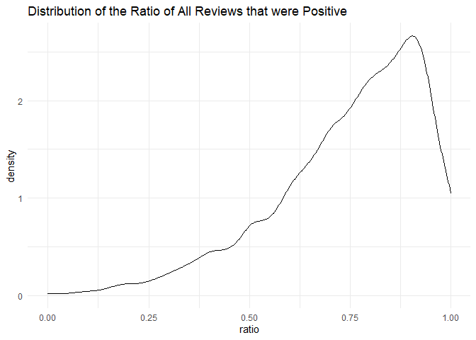
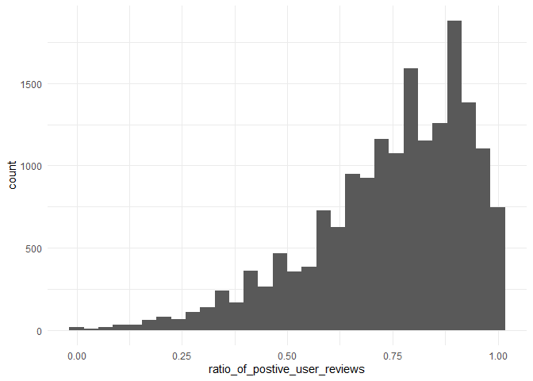

Mini Data-Analysis Deliverable 1
================
Chloe You

1.  Install the [`datateachr`](https://github.com/UBC-MDS/datateachr) package by typing the following into your **R terminal**:

<!-- -->

    install.packages("devtools")
    devtools::install_github("UBC-MDS/datateachr")

1.  Load the packages below.

<!-- -->

    ## -- Attaching packages --------------------------------------- tidyverse 1.3.1 --

    ## v ggplot2 3.3.5     v purrr   0.3.4
    ## v tibble  3.1.5     v dplyr   1.0.7
    ## v tidyr   1.1.3     v stringr 1.4.0
    ## v readr   2.0.2     v forcats 0.5.1

    ## -- Conflicts ------------------------------------------ tidyverse_conflicts() --
    ## x dplyr::filter() masks stats::filter()
    ## x dplyr::lag()    masks stats::lag()

1.  Make a repository in the <https://github.com/stat545ubc-2021> Organization. You will be working with this repository for the entire data analysis project. You can either make it public, or make it private and add the TA's and Vincenzo as collaborators.

2.  When you go to submit, submit a URL to your repository to canvas.

# Task 1: Choose your favorite dataset (10 points)

1.1 Out of the 7 datasets available in the `datateachr` package, choose **4** that appeal to you based on their description. Write your choices below:

**Note**: We encourage you to use the ones in the `datateachr` package, but if you have a dataset that you'd really like to use, you can include it here. But, please check with a member of the teaching team to see whether the dataset is of appropriate complexity. Also, include a **brief** description of the dataset here to help the teaching team understand your data.

1.  steam\_games: Acquired courtesy of Kaggle. It currently has 40833 rows and 21 columns.
2.  cancer\_sample: Acquired courtesy of UCI Machine Learning Repository. It currently has 569 rows and 32 columns.
3.  apt\_buildings: Acquired courtesy of The City of Toronto’s Open Data Portal. It currently has 3455 rows and 37 columns.
4.  parking\_meters: Acquired courtesy of The City of Vancouver’s Open Data Portal. It currently has 10032 rows and 22 columns.

1.2 One way to narrowing down your selection is to *explore* the datasets. Use your knowledge of dplyr to find out at least *3* attributes about each of these datasets (an attribute is something such as number of rows, variables, class type...). The goal here is to have an idea of *what the data looks like*.

*Hint:* This is one of those times when you should think about the cleanliness of your analysis. I added a single code chunk for you, but do you want to use more than one? Would you like to write more comments outside of the code chunk?

##### 1. Steam Games

The Steam Games data set contains 40,833 rows, and 21 columns. The dataset comes in the following classes: "spec\_tbl\_df","tbl\_df", "tbl", "data.frame". Most of the dataset columns contain text.

``` r
# ?steam_games  # gives more in-depth description of the data
glimpse(steam_games)
```

    ## Rows: 40,833
    ## Columns: 21
    ## $ id                       <dbl> 1, 2, 3, 4, 5, 6, 7, 8, 9, 10, 11, 12, 13, 14~
    ## $ url                      <chr> "https://store.steampowered.com/app/379720/DO~
    ## $ types                    <chr> "app", "app", "app", "app", "app", "bundle", ~
    ## $ name                     <chr> "DOOM", "PLAYERUNKNOWN'S BATTLEGROUNDS", "BAT~
    ## $ desc_snippet             <chr> "Now includes all three premium DLC packs (Un~
    ## $ recent_reviews           <chr> "Very Positive,(554),- 89% of the 554 user re~
    ## $ all_reviews              <chr> "Very Positive,(42,550),- 92% of the 42,550 u~
    ## $ release_date             <chr> "May 12, 2016", "Dec 21, 2017", "Apr 24, 2018~
    ## $ developer                <chr> "id Software", "PUBG Corporation", "Harebrain~
    ## $ publisher                <chr> "Bethesda Softworks,Bethesda Softworks", "PUB~
    ## $ popular_tags             <chr> "FPS,Gore,Action,Demons,Shooter,First-Person,~
    ## $ game_details             <chr> "Single-player,Multi-player,Co-op,Steam Achie~
    ## $ languages                <chr> "English,French,Italian,German,Spanish - Spai~
    ## $ achievements             <dbl> 54, 37, 128, NA, NA, NA, 51, 55, 34, 43, 72, ~
    ## $ genre                    <chr> "Action", "Action,Adventure,Massively Multipl~
    ## $ game_description         <chr> "About This Game Developed by id software, th~
    ## $ mature_content           <chr> NA, "Mature Content Description  The develope~
    ## $ minimum_requirements     <chr> "Minimum:,OS:,Windows 7/8.1/10 (64-bit versio~
    ## $ recommended_requirements <chr> "Recommended:,OS:,Windows 7/8.1/10 (64-bit ve~
    ## $ original_price           <dbl> 19.99, 29.99, 39.99, 44.99, 0.00, NA, 59.99, ~
    ## $ discount_price           <dbl> 14.99, NA, NA, NA, NA, 35.18, 70.42, 17.58, N~

``` r
# The variables include 
# 1. "id": the unique ID tied to the game
# 2. "url": link to the game on Steam
# 3. "types": app, bundle, sub
# 4. "name": name of the game
# 5. "desc_snippet": snippet of the game description             
# 6. "recent_reviews": Recent 30 days aggregated review from players. Shows the overall player sentiment towards the game. Example review: "Mixed,(6,214),- 49% of the 6,214 user reviews in the last 30 days are positive.""
# 7. "all_reviews": Similar to `recent_reviews`, `all_reviews` shows the aggregrated review and player sentiment of all players life-to-date.              
# 8. "release_date": The release date of the title
# 9. "developer": The developer of the game           
# 10."publisher": The publisher            
# 11."popular_tags": Tags that describe the game          
# 12."game_details":            
# 13."languages"                
# 14."achievements"            
# 15."genre"                    
# 16."game_description"        
# 17."mature_content": whether there are mature content in the game and what type.  
# 18."minimum_requirements": minimum hardware requirement for PC
# 19."recommended_requirements": recommended hardware requirement for best gameplay experience
# 20."original_price"        
# 21."discount_price" 
```

##### 2. Cancer Samples

The cancer sample data set contains 569 rows, and 32 columns. The dataset comes in the following classes: "spec\_tbl\_df","tbl\_df", "tbl", "data.frame". Other than the ID column which identifies the sample ID, and the `diagnosis` column which is a vector of characters with either "M" for malignant or "B" for benign, all the other 30 columns are numeric and are quantitative measures such as mean and standard error.

``` r
# ?cancer_sample # gives more in-depth description of the data
glimpse(cancer_sample)
```

    ## Rows: 569
    ## Columns: 32
    ## $ ID                      <dbl> 842302, 842517, 84300903, 84348301, 84358402, ~
    ## $ diagnosis               <chr> "M", "M", "M", "M", "M", "M", "M", "M", "M", "~
    ## $ radius_mean             <dbl> 17.990, 20.570, 19.690, 11.420, 20.290, 12.450~
    ## $ texture_mean            <dbl> 10.38, 17.77, 21.25, 20.38, 14.34, 15.70, 19.9~
    ## $ perimeter_mean          <dbl> 122.80, 132.90, 130.00, 77.58, 135.10, 82.57, ~
    ## $ area_mean               <dbl> 1001.0, 1326.0, 1203.0, 386.1, 1297.0, 477.1, ~
    ## $ smoothness_mean         <dbl> 0.11840, 0.08474, 0.10960, 0.14250, 0.10030, 0~
    ## $ compactness_mean        <dbl> 0.27760, 0.07864, 0.15990, 0.28390, 0.13280, 0~
    ## $ concavity_mean          <dbl> 0.30010, 0.08690, 0.19740, 0.24140, 0.19800, 0~
    ## $ concave_points_mean     <dbl> 0.14710, 0.07017, 0.12790, 0.10520, 0.10430, 0~
    ## $ symmetry_mean           <dbl> 0.2419, 0.1812, 0.2069, 0.2597, 0.1809, 0.2087~
    ## $ fractal_dimension_mean  <dbl> 0.07871, 0.05667, 0.05999, 0.09744, 0.05883, 0~
    ## $ radius_se               <dbl> 1.0950, 0.5435, 0.7456, 0.4956, 0.7572, 0.3345~
    ## $ texture_se              <dbl> 0.9053, 0.7339, 0.7869, 1.1560, 0.7813, 0.8902~
    ## $ perimeter_se            <dbl> 8.589, 3.398, 4.585, 3.445, 5.438, 2.217, 3.18~
    ## $ area_se                 <dbl> 153.40, 74.08, 94.03, 27.23, 94.44, 27.19, 53.~
    ## $ smoothness_se           <dbl> 0.006399, 0.005225, 0.006150, 0.009110, 0.0114~
    ## $ compactness_se          <dbl> 0.049040, 0.013080, 0.040060, 0.074580, 0.0246~
    ## $ concavity_se            <dbl> 0.05373, 0.01860, 0.03832, 0.05661, 0.05688, 0~
    ## $ concave_points_se       <dbl> 0.015870, 0.013400, 0.020580, 0.018670, 0.0188~
    ## $ symmetry_se             <dbl> 0.03003, 0.01389, 0.02250, 0.05963, 0.01756, 0~
    ## $ fractal_dimension_se    <dbl> 0.006193, 0.003532, 0.004571, 0.009208, 0.0051~
    ## $ radius_worst            <dbl> 25.38, 24.99, 23.57, 14.91, 22.54, 15.47, 22.8~
    ## $ texture_worst           <dbl> 17.33, 23.41, 25.53, 26.50, 16.67, 23.75, 27.6~
    ## $ perimeter_worst         <dbl> 184.60, 158.80, 152.50, 98.87, 152.20, 103.40,~
    ## $ area_worst              <dbl> 2019.0, 1956.0, 1709.0, 567.7, 1575.0, 741.6, ~
    ## $ smoothness_worst        <dbl> 0.1622, 0.1238, 0.1444, 0.2098, 0.1374, 0.1791~
    ## $ compactness_worst       <dbl> 0.6656, 0.1866, 0.4245, 0.8663, 0.2050, 0.5249~
    ## $ concavity_worst         <dbl> 0.71190, 0.24160, 0.45040, 0.68690, 0.40000, 0~
    ## $ concave_points_worst    <dbl> 0.26540, 0.18600, 0.24300, 0.25750, 0.16250, 0~
    ## $ symmetry_worst          <dbl> 0.4601, 0.2750, 0.3613, 0.6638, 0.2364, 0.3985~
    ## $ fractal_dimension_worst <dbl> 0.11890, 0.08902, 0.08758, 0.17300, 0.07678, 0~

##### 3. apt\_buildings

The apt\_buildings data set contains 3,455 rows and 37 columns. The column data types are a mix of characters and doubles.

``` r
# ?apt_buildings # gives more in-depth description of the data
glimpse(apt_buildings)
```

    ## Rows: 3,455
    ## Columns: 37
    ## $ id                               <dbl> 10359, 10360, 10361, 10362, 10363, 10~
    ## $ air_conditioning                 <chr> "NONE", "NONE", "NONE", "NONE", "NONE~
    ## $ amenities                        <chr> "Outdoor rec facilities", "Outdoor po~
    ## $ balconies                        <chr> "YES", "YES", "YES", "YES", "NO", "NO~
    ## $ barrier_free_accessibilty_entr   <chr> "YES", "NO", "NO", "YES", "NO", "NO",~
    ## $ bike_parking                     <chr> "0 indoor parking spots and 10 outdoo~
    ## $ exterior_fire_escape             <chr> "NO", "NO", "NO", "YES", "NO", NA, "N~
    ## $ fire_alarm                       <chr> "YES", "YES", "YES", "YES", "YES", "Y~
    ## $ garbage_chutes                   <chr> "YES", "YES", "NO", "NO", "NO", "NO",~
    ## $ heating_type                     <chr> "HOT WATER", "HOT WATER", "HOT WATER"~
    ## $ intercom                         <chr> "YES", "YES", "YES", "YES", "YES", "Y~
    ## $ laundry_room                     <chr> "YES", "YES", "YES", "YES", "YES", "Y~
    ## $ locker_or_storage_room           <chr> "NO", "YES", "YES", "YES", "NO", "YES~
    ## $ no_of_elevators                  <dbl> 3, 3, 0, 1, 0, 0, 0, 2, 4, 2, 0, 2, 2~
    ## $ parking_type                     <chr> "Underground Garage , Garage accessib~
    ## $ pets_allowed                     <chr> "YES", "YES", "YES", "YES", "YES", "Y~
    ## $ prop_management_company_name     <chr> NA, "SCHICKEDANZ BROS. PROPERTIES", N~
    ## $ property_type                    <chr> "PRIVATE", "PRIVATE", "PRIVATE", "PRI~
    ## $ rsn                              <dbl> 4154812, 4154815, 4155295, 4155309, 4~
    ## $ separate_gas_meters              <chr> "NO", "NO", "NO", "NO", "NO", "NO", "~
    ## $ separate_hydro_meters            <chr> "YES", "YES", "YES", "YES", "YES", "Y~
    ## $ separate_water_meters            <chr> "NO", "NO", "NO", "NO", "NO", "NO", "~
    ## $ site_address                     <chr> "65  FOREST MANOR RD", "70  CLIPPER R~
    ## $ sprinkler_system                 <chr> "YES", "YES", "NO", "YES", "NO", "NO"~
    ## $ visitor_parking                  <chr> "PAID", "FREE", "UNAVAILABLE", "UNAVA~
    ## $ ward                             <chr> "17", "17", "03", "03", "02", "02", "~
    ## $ window_type                      <chr> "DOUBLE PANE", "DOUBLE PANE", "DOUBLE~
    ## $ year_built                       <dbl> 1967, 1970, 1927, 1959, 1943, 1952, 1~
    ## $ year_registered                  <dbl> 2017, 2017, 2017, 2017, 2017, NA, 201~
    ## $ no_of_storeys                    <dbl> 17, 14, 4, 5, 4, 4, 4, 7, 32, 4, 4, 7~
    ## $ emergency_power                  <chr> "NO", "YES", "NO", "NO", "NO", "NO", ~
    ## $ `non-smoking_building`           <chr> "YES", "NO", "YES", "YES", "YES", "NO~
    ## $ no_of_units                      <dbl> 218, 206, 34, 42, 25, 34, 14, 105, 57~
    ## $ no_of_accessible_parking_spaces  <dbl> 8, 10, 20, 42, 12, 0, 5, 1, 1, 6, 12,~
    ## $ facilities_available             <chr> "Recycling bins", "Green Bin / Organi~
    ## $ cooling_room                     <chr> "NO", "NO", "NO", "NO", "NO", "NO", "~
    ## $ no_barrier_free_accessible_units <dbl> 2, 0, 0, 42, 0, NA, 14, 0, 0, 1, 25, ~

##### 4. parking\_meters

This dataset contains information on the rates and time limits for parking meters in Vancouver. Information is shown for entire block faces rather than for individual meters. The parking\_meters data set contains 10,232 rows and 22 columns. The columns are a mix of characters and doubles.

``` r
# ?parking_meters # gives more in-depth description of the data
glimpse(parking_meters)
```

    ## Rows: 10,032
    ## Columns: 22
    ## $ meter_head     <chr> "Twin", "Pay Station", "Twin", "Single", "Twin", "Twin"~
    ## $ r_mf_9a_6p     <chr> "$2.00", "$1.00", "$1.00", "$1.00", "$2.00", "$2.00", "~
    ## $ r_mf_6p_10     <chr> "$4.00", "$1.00", "$1.00", "$1.00", "$1.00", "$1.00", "~
    ## $ r_sa_9a_6p     <chr> "$2.00", "$1.00", "$1.00", "$1.00", "$2.00", "$2.00", "~
    ## $ r_sa_6p_10     <chr> "$4.00", "$1.00", "$1.00", "$1.00", "$1.00", "$1.00", "~
    ## $ r_su_9a_6p     <chr> "$2.00", "$1.00", "$1.00", "$1.00", "$2.00", "$2.00", "~
    ## $ r_su_6p_10     <chr> "$4.00", "$1.00", "$1.00", "$1.00", "$1.00", "$1.00", "~
    ## $ rate_misc      <chr> NA, "$ .50", NA, NA, NA, NA, NA, NA, NA, NA, NA, NA, NA~
    ## $ time_in_effect <chr> "METER IN EFFECT: 9:00 AM TO 10:00 PM", "METER IN EFFEC~
    ## $ t_mf_9a_6p     <chr> "2 Hr", "10 Hrs", "2 Hr", "2 Hr", "2 Hr", "3 Hr", "2 Hr~
    ## $ t_mf_6p_10     <chr> "4 Hr", "10 Hrs", "4 Hr", "4 Hr", "4 Hr", "4 Hr", "4 Hr~
    ## $ t_sa_9a_6p     <chr> "2 Hr", "10 Hrs", "2 Hr", "2 Hr", "2 Hr", "3 Hr", "2 Hr~
    ## $ t_sa_6p_10     <chr> "4 Hr", "10 Hrs", "4 Hr", "4 Hr", "4 Hr", "4 Hr", "4 Hr~
    ## $ t_su_9a_6p     <chr> "2 Hr", "10 Hrs", "2 Hr", "2 Hr", "2 Hr", "3 Hr", "2 Hr~
    ## $ t_su_6p_10     <chr> "4 Hr", "10 Hrs", "4 Hr", "4 Hr", "4 Hr", "4 Hr", "4 Hr~
    ## $ time_misc      <chr> NA, "No Time Limit", NA, NA, NA, NA, NA, NA, NA, NA, NA~
    ## $ credit_card    <chr> "No", "Yes", "No", "No", "No", "No", "No", "No", "No", ~
    ## $ pay_phone      <chr> "66890", "59916", "57042", "57159", "51104", "60868", "~
    ## $ longitude      <dbl> -123.1289, -123.0982, -123.1013, -123.1862, -123.1278, ~
    ## $ latitude       <dbl> 49.28690, 49.27215, 49.25468, 49.26341, 49.26354, 49.27~
    ## $ geo_local_area <chr> "West End", "Strathcona", "Riley Park", "West Point Gre~
    ## $ meter_id       <chr> "670805", "471405", "C80145", "D03704", "301023", "5913~

1.3 Now that you've explored the 4 datasets that you were initially most interested in, let's narrow it down to 2. What lead you to choose these 2? Briefly explain your choices below, and feel free to include any code in your explanation.

------------------------------------------------------------------------

I will be analyzing `steam_games` and `cancer_samples` datasets. I am interested in video games and would like to see if there are any interesting trends in the data. I'm also interested in seeing how cancer data is presented and would like to try analyzing it.

------------------------------------------------------------------------

1.4 Time for the final decision! Going back to the beginning, it's important to have an *end goal* in mind. For example, if I had chosen the `titanic` dataset for my project, I might've wanted to explore the relationship between survival and other variables. Try to think of 1 research question that you would want to answer with each dataset. Note them down below, and make your final choice based on what seems more interesting to you!

------------------------------------------------------------------------

1.4.1: For Steam games, I'm interested in seeing whether factors such as genre, publisher, popular tags, release date are associated with the number of total reviews a game recieves, as well as the player sentiment(% of total reviews that are positive). If associations and trends can be identified, the next step is to predict player sentiment for future games with certain attributes.

1.4.2: For cancer samples, we can look at if there are significant differences in the quantitative features that were calculated from images of nuclei present in fine needle aspiration biopsies of breast masses between the patients who were diagnosed as malignant or begign. If some of the quatitative features show signs of significant differences between the two cohorts, they can potentially become one of the clinical diagnosis measures in practice.

**Final Choice: Steam Game dataset will be used for the rest of the report.**

------------------------------------------------------------------------

# Important note

Read Tasks 2 and 3 *fully* before starting to complete either of them. Probably also a good point to grab a coffee to get ready for the fun part!

This project is semi-guided, but meant to be *independent*. For this reason, you will complete tasks 2 and 3 below (under the **START HERE** mark) as if you were writing your own exploratory data analysis report, and this guidance never existed! Feel free to add a brief introduction section to your project, format the document with markdown syntax as you deem appropriate, and structure the analysis as you deem appropriate. Remember, marks will be awarded for completion of the 4 tasks, but 10 points of the whole project are allocated to a reproducible and clean analysis. If you feel lost, you can find a sample data analysis [here](https://www.kaggle.com/headsortails/tidy-titarnic) to have a better idea. However, bear in mind that it is **just an example** and you will not be required to have that level of complexity in your project.

# Task 2: Exploring your dataset (15 points)

If we rewind and go back to the learning objectives, you'll see that by the end of this deliverable, you should have formulated *4* research questions about your data that you may want to answer during your project. However, it may be handy to do some more exploration on your dataset of choice before creating these questions - by looking at the data, you may get more ideas. **Before you start this task, read all instructions carefully until you reach START HERE**.

2.1 Complete *4 out of the following 8 exercises* to dive deeper into your data. All datasets are different and therefore, not all of these tasks may make sense for your data - which is why you should only answer *4*. Use *dplyr* and *ggplot*.

1.  Plot the distribution of a numeric variable.
2.  Create a new variable based on other variables in your data (only if it makes sense)
3.  Investigate how many missing values there are per variable. Can you find a way to plot this?
4.  Explore the relationship between 2 variables in a plot.
5.  Filter observations in your data according to your own criteria. Think of what you'd like to explore - again, if this was the `titanic` dataset, I may want to narrow my search down to passengers born in a particular year...
6.  Use a boxplot to look at the frequency of different observations within a single variable. You can do this for more than one variable if you wish!
7.  Make a new tibble with a subset of your data, with variables and observations that you are interested in exploring.
8.  Use a density plot to explore any of your variables (that are suitable for this type of plot).

2.2 For each of the 4 exercises that you complete, provide a *brief explanation* of why you chose that exercise in relation to your data (in other words, why does it make sense to do that?), and sufficient comments for a reader to understand your reasoning and code.

# Task 3: Write your research questions (5 points)

So far, you have chosen a dataset and gotten familiar with it through exploring the data. Now it's time to figure out 4 research questions that you would like to answer with your data! Write the 4 questions and any additional comments at the end of this deliverable. These questions are not necessarily set in stone - TAs will review them and give you feedback; therefore, you may choose to pursue them as they are for the rest of the project, or make modifications!

## <!--- *****START HERE***** --->

## Exploratory Analysis

Before we dive into the data, notice that the game name is not the unique identifier of each row.

``` r
nrow(steam_games) == length(unique(steam_games$name)) 
```

    ## [1] FALSE

``` r
## 40833   40752
nrow(steam_games[steam_games$types=='app',]) == length(unique(steam_games[steam_games$types=='app',]$name)) 
```

    ## [1] FALSE

``` r
# 38,023   37,964 
## some game titles are not unique in the data but not too many
```

###### 1. Create a new variable based on other variables in your data (only if it makes sense)

`ratio_of_postive_user_reviews`: extracted from `all_reviews`, the ratio of all reviews that were positive.

``` r
# creates new column and coverts character to double
sg_copy = steam_games %>% mutate(ratio_of_postive_user_reviews = as.numeric(str_match(all_reviews, ",- \\s*(.*?)\\s*% of the")[,2])/100 )
# glimpse(sg_copy)
```

`number_of_total_reviews`: extracted from `all_reviews`, the total number of user reviews since the game was released.

``` r
# creates new column and coverts character to double
sg_copy = sg_copy %>% mutate(number_of_total_reviews =  as.numeric(gsub(",","",str_match(all_reviews, "of the \\s*(.*?)\\s* user")[,2])))
# glimpse(sg_copy)
```

###### 2. Filter observations in your data according to your own criteria.

We will only keep data that are of the `app` type which refers to the standard game. Since`bundle` and `sub` are referring to expansion packs or the sale contains other things tha the base game and is not a good measure for player sentiment of the game itself.

``` r
sg_copy = sg_copy %>% filter(types == 'app')
dim(sg_copy) # 40,833 rows dropped to 38,021
```

    ## [1] 38021    23

``` r
# glimpse(sg_copy)
```

###### 3. Investigate how many missing values there are per variable. Can you find a way to plot this?

``` r
NA_rate <- sg_copy %>% 
 summarise(col_name= colnames(sg_copy),num_NA=colSums(is.na(.)), proportion_of_all_row= num_NA/nrow(sg_copy)) %>% 
  arrange(desc(proportion_of_all_row))

ggplot(NA_rate, aes(x=reorder(col_name, proportion_of_all_row), y= proportion_of_all_row)) + 
  geom_bar(stat='identity') + 
  coord_flip()
```

 Notice that 25% of the 38K rows have NA as `all_reviews`. But a missing value rate of ~50% of the extracted variables. With further investigation, we indentified that titles with too few reviews will not get a summarized player sentiment. Their `all_reviews` look something like "9 user reviews,- Need more user reviews to generate a score". **For this analysis we won't consider player sentiment for these games**.

**Overall we see that around half of the games in this dataset weren't given enough reviews. Keeping that in mind, we will continue our analysis on the other half which have recieved enough reviews.**

###### 4. Make a new tibble with a subset of your data, with variables and observations that you are interested in exploring.

Since we are interested in effects of genre, developer, popular tags, release time on volume of review and player sentiment, we will keep columns related to them and remove the other ones.

``` r
# colnames(sg_copy)
sg_copy <- sg_copy %>% select(name, genre, developer, ratio_of_postive_user_reviews, number_of_total_reviews, release_date, game_details, popular_tags)
```

###### 5. Plot the distribution of a numeric variable.

We will plot the distribution of player sentiment of titles to get a general understanding of how often a title is viewed positively.

``` r
ggplot(sg_copy, aes(x=ratio_of_postive_user_reviews)) +
   geom_histogram() + theme_minimal()
```

    ## `stat_bin()` using `bins = 30`. Pick better value with `binwidth`.

    ## Warning: Removed 20658 rows containing non-finite values (stat_bin).

 Based on the distribtion, it seems like most titles left in the dataset have proportion of reviews skewing towards the positive side (50% and above).

## Research Questions

1.  Do some developers get more positive reviews? Some studios recieve better public sentiment. My hypothesis is that the bigger developers tend to get more mixed reviews (ratio of reviews that are positive lean towards 50%); on the other hand gamers are more forgiving towards smaller developers and hence will have more positive reviews.

2.  Do certain genres get more positive reviews proportionally? What's the difference between genres in terms of the average and total volume of reviews and average proportion of positive reviews of each genre. The hypothesis is that for simulation and indie game, generally the player population are less intense and more forgiving therefore there will be more positive reviews. For Massively Multiplayer games, since the player community can be quite diverse, there are usually more toxic gameplay behaviour which can often be reflected in the less positive reviews on Steam.

3.  Which developer produces the most games and receives the most positive reviews? We can see how much of the market a developer takes up in the market and also gauge player sentiment towards a developer from these metrics.

4.  Use logistic regression with the above variables with player sentiment as outcome variable and see if we can interpret the coefficients of the model. Interpreations of the coefficients can help us quantify how each factor contributes to player reviews.

------------------------------------------------------------------------

### Attribution

Thanks to Icíar Fernández Boyano for mostly putting this together, and Vincenzo Coia for launching.
