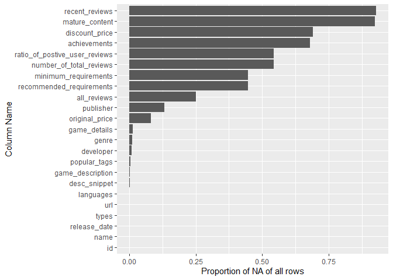
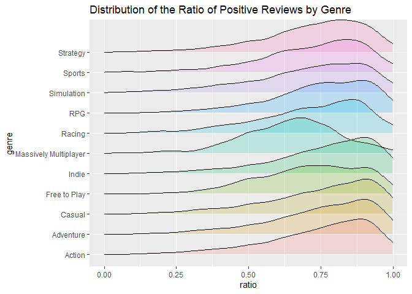

Mini Data-Analysis Deliverable 1
================
Chloe You

### Introduction

This report is for Milestone 1 of the Mini Data Analysis. Within the report, we will explore four datasets and perform more in-depth data cleaning and exploratory analysis with plots and summaries. The final dataset that was chosen for this analysis is the Steam Games dataset which contains games from steam shop with detailed data.

### Housekeeping Code

``` r
# install.packages("devtools")
# devtools::install_github("UBC-MDS/datateachr")
library(datateachr)
library(tidyverse)
```

    ## -- Attaching packages --------------------------------------- tidyverse 1.3.1 --

    ## v ggplot2 3.3.5     v purrr   0.3.4
    ## v tibble  3.1.5     v dplyr   1.0.7
    ## v tidyr   1.1.3     v stringr 1.4.0
    ## v readr   2.0.2     v forcats 0.5.1

    ## -- Conflicts ------------------------------------------ tidyverse_conflicts() --
    ## x dplyr::filter() masks stats::filter()
    ## x dplyr::lag()    masks stats::lag()

### Choose 4 datasets

1.  steam\_games
2.  cancer\_sample
3.  apt\_buildings
4.  parking\_meters

### Explore the 4 datasets

##### 1. Steam Games

The Steam Games data set contains 40,833 rows, and 21 columns. The dataset comes in the following classes: "spec\_tbl\_df","tbl\_df", "tbl", "data.frame". Most of the dataset columns contain text. In order to get the player reviews from the data as numeric values for analysis, we'll need to extract from the strings.

``` r
# ?steam_games  # gives more in-depth description of the data
glimpse(steam_games)
```

    ## Rows: 40,833
    ## Columns: 21
    ## $ id                       <dbl> 1, 2, 3, 4, 5, 6, 7, 8, 9, 10, 11, 12, 13, 14~
    ## $ url                      <chr> "https://store.steampowered.com/app/379720/DO~
    ## $ types                    <chr> "app", "app", "app", "app", "app", "bundle", ~
    ## $ name                     <chr> "DOOM", "PLAYERUNKNOWN'S BATTLEGROUNDS", "BAT~
    ## $ desc_snippet             <chr> "Now includes all three premium DLC packs (Un~
    ## $ recent_reviews           <chr> "Very Positive,(554),- 89% of the 554 user re~
    ## $ all_reviews              <chr> "Very Positive,(42,550),- 92% of the 42,550 u~
    ## $ release_date             <chr> "May 12, 2016", "Dec 21, 2017", "Apr 24, 2018~
    ## $ developer                <chr> "id Software", "PUBG Corporation", "Harebrain~
    ## $ publisher                <chr> "Bethesda Softworks,Bethesda Softworks", "PUB~
    ## $ popular_tags             <chr> "FPS,Gore,Action,Demons,Shooter,First-Person,~
    ## $ game_details             <chr> "Single-player,Multi-player,Co-op,Steam Achie~
    ## $ languages                <chr> "English,French,Italian,German,Spanish - Spai~
    ## $ achievements             <dbl> 54, 37, 128, NA, NA, NA, 51, 55, 34, 43, 72, ~
    ## $ genre                    <chr> "Action", "Action,Adventure,Massively Multipl~
    ## $ game_description         <chr> "About This Game Developed by id software, th~
    ## $ mature_content           <chr> NA, "Mature Content Description  The develope~
    ## $ minimum_requirements     <chr> "Minimum:,OS:,Windows 7/8.1/10 (64-bit versio~
    ## $ recommended_requirements <chr> "Recommended:,OS:,Windows 7/8.1/10 (64-bit ve~
    ## $ original_price           <dbl> 19.99, 29.99, 39.99, 44.99, 0.00, NA, 59.99, ~
    ## $ discount_price           <dbl> 14.99, NA, NA, NA, NA, 35.18, 70.42, 17.58, N~

##### 2. Cancer Samples

The cancer sample data set contains 569 rows, and 32 columns. The dataset comes in the following classes: "spec\_tbl\_df","tbl\_df", "tbl", "data.frame". Other than the ID column which identifies the sample ID, and the `diagnosis` column which is a vector of characters with either "M" for malignant or "B" for benign, all the other 30 columns are numeric and are quantitative measures such as mean and standard error.

``` r
# ?cancer_sample # gives more in-depth description of the data
glimpse(cancer_sample)
```

    ## Rows: 569
    ## Columns: 32
    ## $ ID                      <dbl> 842302, 842517, 84300903, 84348301, 84358402, ~
    ## $ diagnosis               <chr> "M", "M", "M", "M", "M", "M", "M", "M", "M", "~
    ## $ radius_mean             <dbl> 17.990, 20.570, 19.690, 11.420, 20.290, 12.450~
    ## $ texture_mean            <dbl> 10.38, 17.77, 21.25, 20.38, 14.34, 15.70, 19.9~
    ## $ perimeter_mean          <dbl> 122.80, 132.90, 130.00, 77.58, 135.10, 82.57, ~
    ## $ area_mean               <dbl> 1001.0, 1326.0, 1203.0, 386.1, 1297.0, 477.1, ~
    ## $ smoothness_mean         <dbl> 0.11840, 0.08474, 0.10960, 0.14250, 0.10030, 0~
    ## $ compactness_mean        <dbl> 0.27760, 0.07864, 0.15990, 0.28390, 0.13280, 0~
    ## $ concavity_mean          <dbl> 0.30010, 0.08690, 0.19740, 0.24140, 0.19800, 0~
    ## $ concave_points_mean     <dbl> 0.14710, 0.07017, 0.12790, 0.10520, 0.10430, 0~
    ## $ symmetry_mean           <dbl> 0.2419, 0.1812, 0.2069, 0.2597, 0.1809, 0.2087~
    ## $ fractal_dimension_mean  <dbl> 0.07871, 0.05667, 0.05999, 0.09744, 0.05883, 0~
    ## $ radius_se               <dbl> 1.0950, 0.5435, 0.7456, 0.4956, 0.7572, 0.3345~
    ## $ texture_se              <dbl> 0.9053, 0.7339, 0.7869, 1.1560, 0.7813, 0.8902~
    ## $ perimeter_se            <dbl> 8.589, 3.398, 4.585, 3.445, 5.438, 2.217, 3.18~
    ## $ area_se                 <dbl> 153.40, 74.08, 94.03, 27.23, 94.44, 27.19, 53.~
    ## $ smoothness_se           <dbl> 0.006399, 0.005225, 0.006150, 0.009110, 0.0114~
    ## $ compactness_se          <dbl> 0.049040, 0.013080, 0.040060, 0.074580, 0.0246~
    ## $ concavity_se            <dbl> 0.05373, 0.01860, 0.03832, 0.05661, 0.05688, 0~
    ## $ concave_points_se       <dbl> 0.015870, 0.013400, 0.020580, 0.018670, 0.0188~
    ## $ symmetry_se             <dbl> 0.03003, 0.01389, 0.02250, 0.05963, 0.01756, 0~
    ## $ fractal_dimension_se    <dbl> 0.006193, 0.003532, 0.004571, 0.009208, 0.0051~
    ## $ radius_worst            <dbl> 25.38, 24.99, 23.57, 14.91, 22.54, 15.47, 22.8~
    ## $ texture_worst           <dbl> 17.33, 23.41, 25.53, 26.50, 16.67, 23.75, 27.6~
    ## $ perimeter_worst         <dbl> 184.60, 158.80, 152.50, 98.87, 152.20, 103.40,~
    ## $ area_worst              <dbl> 2019.0, 1956.0, 1709.0, 567.7, 1575.0, 741.6, ~
    ## $ smoothness_worst        <dbl> 0.1622, 0.1238, 0.1444, 0.2098, 0.1374, 0.1791~
    ## $ compactness_worst       <dbl> 0.6656, 0.1866, 0.4245, 0.8663, 0.2050, 0.5249~
    ## $ concavity_worst         <dbl> 0.71190, 0.24160, 0.45040, 0.68690, 0.40000, 0~
    ## $ concave_points_worst    <dbl> 0.26540, 0.18600, 0.24300, 0.25750, 0.16250, 0~
    ## $ symmetry_worst          <dbl> 0.4601, 0.2750, 0.3613, 0.6638, 0.2364, 0.3985~
    ## $ fractal_dimension_worst <dbl> 0.11890, 0.08902, 0.08758, 0.17300, 0.07678, 0~

##### 3. apt\_buildings

The apt\_buildings data set contains 3,455 rows and 37 columns. The column data types are a mix of characters and doubles.

``` r
# ?apt_buildings # gives more in-depth description of the data
glimpse(apt_buildings)
```

    ## Rows: 3,455
    ## Columns: 37
    ## $ id                               <dbl> 10359, 10360, 10361, 10362, 10363, 10~
    ## $ air_conditioning                 <chr> "NONE", "NONE", "NONE", "NONE", "NONE~
    ## $ amenities                        <chr> "Outdoor rec facilities", "Outdoor po~
    ## $ balconies                        <chr> "YES", "YES", "YES", "YES", "NO", "NO~
    ## $ barrier_free_accessibilty_entr   <chr> "YES", "NO", "NO", "YES", "NO", "NO",~
    ## $ bike_parking                     <chr> "0 indoor parking spots and 10 outdoo~
    ## $ exterior_fire_escape             <chr> "NO", "NO", "NO", "YES", "NO", NA, "N~
    ## $ fire_alarm                       <chr> "YES", "YES", "YES", "YES", "YES", "Y~
    ## $ garbage_chutes                   <chr> "YES", "YES", "NO", "NO", "NO", "NO",~
    ## $ heating_type                     <chr> "HOT WATER", "HOT WATER", "HOT WATER"~
    ## $ intercom                         <chr> "YES", "YES", "YES", "YES", "YES", "Y~
    ## $ laundry_room                     <chr> "YES", "YES", "YES", "YES", "YES", "Y~
    ## $ locker_or_storage_room           <chr> "NO", "YES", "YES", "YES", "NO", "YES~
    ## $ no_of_elevators                  <dbl> 3, 3, 0, 1, 0, 0, 0, 2, 4, 2, 0, 2, 2~
    ## $ parking_type                     <chr> "Underground Garage , Garage accessib~
    ## $ pets_allowed                     <chr> "YES", "YES", "YES", "YES", "YES", "Y~
    ## $ prop_management_company_name     <chr> NA, "SCHICKEDANZ BROS. PROPERTIES", N~
    ## $ property_type                    <chr> "PRIVATE", "PRIVATE", "PRIVATE", "PRI~
    ## $ rsn                              <dbl> 4154812, 4154815, 4155295, 4155309, 4~
    ## $ separate_gas_meters              <chr> "NO", "NO", "NO", "NO", "NO", "NO", "~
    ## $ separate_hydro_meters            <chr> "YES", "YES", "YES", "YES", "YES", "Y~
    ## $ separate_water_meters            <chr> "NO", "NO", "NO", "NO", "NO", "NO", "~
    ## $ site_address                     <chr> "65  FOREST MANOR RD", "70  CLIPPER R~
    ## $ sprinkler_system                 <chr> "YES", "YES", "NO", "YES", "NO", "NO"~
    ## $ visitor_parking                  <chr> "PAID", "FREE", "UNAVAILABLE", "UNAVA~
    ## $ ward                             <chr> "17", "17", "03", "03", "02", "02", "~
    ## $ window_type                      <chr> "DOUBLE PANE", "DOUBLE PANE", "DOUBLE~
    ## $ year_built                       <dbl> 1967, 1970, 1927, 1959, 1943, 1952, 1~
    ## $ year_registered                  <dbl> 2017, 2017, 2017, 2017, 2017, NA, 201~
    ## $ no_of_storeys                    <dbl> 17, 14, 4, 5, 4, 4, 4, 7, 32, 4, 4, 7~
    ## $ emergency_power                  <chr> "NO", "YES", "NO", "NO", "NO", "NO", ~
    ## $ `non-smoking_building`           <chr> "YES", "NO", "YES", "YES", "YES", "NO~
    ## $ no_of_units                      <dbl> 218, 206, 34, 42, 25, 34, 14, 105, 57~
    ## $ no_of_accessible_parking_spaces  <dbl> 8, 10, 20, 42, 12, 0, 5, 1, 1, 6, 12,~
    ## $ facilities_available             <chr> "Recycling bins", "Green Bin / Organi~
    ## $ cooling_room                     <chr> "NO", "NO", "NO", "NO", "NO", "NO", "~
    ## $ no_barrier_free_accessible_units <dbl> 2, 0, 0, 42, 0, NA, 14, 0, 0, 1, 25, ~

##### 4. parking\_meters

This dataset contains information on the rates and time limits for parking meters in Vancouver. Information is shown for entire block faces rather than for individual meters. The parking\_meters data set contains 10,232 rows and 22 columns. The columns are a mix of characters and doubles.

``` r
# ?parking_meters # gives more in-depth description of the data
glimpse(parking_meters)
```

    ## Rows: 10,032
    ## Columns: 22
    ## $ meter_head     <chr> "Twin", "Pay Station", "Twin", "Single", "Twin", "Twin"~
    ## $ r_mf_9a_6p     <chr> "$2.00", "$1.00", "$1.00", "$1.00", "$2.00", "$2.00", "~
    ## $ r_mf_6p_10     <chr> "$4.00", "$1.00", "$1.00", "$1.00", "$1.00", "$1.00", "~
    ## $ r_sa_9a_6p     <chr> "$2.00", "$1.00", "$1.00", "$1.00", "$2.00", "$2.00", "~
    ## $ r_sa_6p_10     <chr> "$4.00", "$1.00", "$1.00", "$1.00", "$1.00", "$1.00", "~
    ## $ r_su_9a_6p     <chr> "$2.00", "$1.00", "$1.00", "$1.00", "$2.00", "$2.00", "~
    ## $ r_su_6p_10     <chr> "$4.00", "$1.00", "$1.00", "$1.00", "$1.00", "$1.00", "~
    ## $ rate_misc      <chr> NA, "$ .50", NA, NA, NA, NA, NA, NA, NA, NA, NA, NA, NA~
    ## $ time_in_effect <chr> "METER IN EFFECT: 9:00 AM TO 10:00 PM", "METER IN EFFEC~
    ## $ t_mf_9a_6p     <chr> "2 Hr", "10 Hrs", "2 Hr", "2 Hr", "2 Hr", "3 Hr", "2 Hr~
    ## $ t_mf_6p_10     <chr> "4 Hr", "10 Hrs", "4 Hr", "4 Hr", "4 Hr", "4 Hr", "4 Hr~
    ## $ t_sa_9a_6p     <chr> "2 Hr", "10 Hrs", "2 Hr", "2 Hr", "2 Hr", "3 Hr", "2 Hr~
    ## $ t_sa_6p_10     <chr> "4 Hr", "10 Hrs", "4 Hr", "4 Hr", "4 Hr", "4 Hr", "4 Hr~
    ## $ t_su_9a_6p     <chr> "2 Hr", "10 Hrs", "2 Hr", "2 Hr", "2 Hr", "3 Hr", "2 Hr~
    ## $ t_su_6p_10     <chr> "4 Hr", "10 Hrs", "4 Hr", "4 Hr", "4 Hr", "4 Hr", "4 Hr~
    ## $ time_misc      <chr> NA, "No Time Limit", NA, NA, NA, NA, NA, NA, NA, NA, NA~
    ## $ credit_card    <chr> "No", "Yes", "No", "No", "No", "No", "No", "No", "No", ~
    ## $ pay_phone      <chr> "66890", "59916", "57042", "57159", "51104", "60868", "~
    ## $ longitude      <dbl> -123.1289, -123.0982, -123.1013, -123.1862, -123.1278, ~
    ## $ latitude       <dbl> 49.28690, 49.27215, 49.25468, 49.26341, 49.26354, 49.27~
    ## $ geo_local_area <chr> "West End", "Strathcona", "Riley Park", "West Point Gre~
    ## $ meter_id       <chr> "670805", "471405", "C80145", "D03704", "301023", "5913~

### Narrow down to 2 datasets and Explain

I will be analyzing `steam_games` and `cancer_samples` datasets. I am interested in video games and would like to see if there are any interesting trends in the data. I'm also interested in seeing how cancer data is stored in practive and would like to try analyzing it.

### Research questions and Final Decision for 1 Dataset

1.  For Steam games, I'm interested in seeing whether factors such as genre, publisher, popular tags, release date are associated with the number of total reviews a game recieves, as well as the player sentiment(% of total reviews that are positive). If associations and trends can be identified, the next step is to predict player sentiment for future games with certain attributes.

2.  For cancer samples, we can look at if there are significant differences in the quantitative features that were calculated from images of nuclei present in fine needle aspiration biopsies of breast masses between the patients who were diagnosed as malignant or begign. If some of the quatitative features show signs of significant differences between the two cohorts, they can potentially become one of the clinical diagnosis measures in practice.

Final Choice: `steam_games` dataset will be used for the rest of the report.

### Exploratory Analysis

Before we dive into the data, notice that the game name is not the unique identifier of each row.

``` r
nrow(steam_games) == length(unique(steam_games$name)) 
# 40833   40752
nrow(steam_games[steam_games$types=='app',]) == length(unique(steam_games[steam_games$types=='app',]$name)) 
# 38,023   37,964 
# some game titles are not unique in the data but not too many
```

###### 1. Create a new variable based on other variables in your data (only if it makes sense)

Reason: The review values are currently stored in columns that are stored as strings. We will need to extract them from the string and store them as numeric values for easier analysis later on.

`ratio_of_postive_user_reviews`: extracted from `all_reviews`, the ratio of all reviews that were positive.

``` r
# creates new column and coverts character to double
sg_copy = steam_games %>% 
  mutate(ratio_of_postive_user_reviews = as.numeric(str_match(all_reviews, ",- \\s*(.*?)\\s*% of the")[,2])/100 )
# glimpse(sg_copy)
```

`number_of_total_reviews`: extracted from `all_reviews`, the total number of user reviews since the game was released.

``` r
# creates new column and coverts character to double
sg_copy = sg_copy %>% mutate(number_of_total_reviews =  as.numeric(gsub(",","",str_match(all_reviews, "of the \\s*(.*?)\\s* user")[,2])))
# glimpse(sg_copy)
```

###### 2. Filter observations in your data according to your own criteria.

Reason: We will only keep data that are of the `app` type which refers to the standard game. Since`bundle` and `sub` are referring to expansion packs or the sale contains other things tha the base game and is not a good measure for player sentiment of the game itself.

``` r
sg_copy = sg_copy %>% filter(types == 'app')
dim(sg_copy) # 40,833 rows dropped to 38,021
```

    ## [1] 38021    23

``` r
# glimpse(sg_copy)
```

###### 3. Investigate how many missing values there are per variable. Can you find a way to plot this?

Reason: By checking Null rates in the data, we can see what variables can be used for future analysis. If a column contains too many NA and missing values, it wouldn't be giving us useful information. Additionally, by checking Null rate in the newly recreated columns, we can double check if our extraction from step 1 created any issues.

``` r
NA_rate <- sg_copy %>% 
 summarise(col_name= colnames(sg_copy),num_NA=colSums(is.na(.)), proportion_of_all_row= num_NA/nrow(sg_copy)) %>% 
  arrange(desc(proportion_of_all_row))

ggplot(NA_rate, aes(x=reorder(col_name, proportion_of_all_row), y= proportion_of_all_row)) + 
  geom_bar(stat='identity') + 
  coord_flip() +
  ylab("Proportion of NA of all rows") +
  xlab("Column Name")
```



Notice that 25% of the 38K rows have NA as `all_reviews`. But a missing value rate of ~50% of the extracted variables. With further investigation, we indentified that titles with too few reviews will not get a summarized player sentiment. Their `all_reviews` look something like "9 user reviews,- Need more user reviews to generate a score". **For this analysis we won't consider player sentiment for these games**.

**Overall we see that around half of the games in this dataset weren't given enough reviews. Keeping that in mind, we will continue our analysis on the other half which have recieved enough reviews.**

###### 4. Plot the distribution of a numeric variable.

Reason: We will plot the distribution of player sentiment of titles to get a general understanding of how often a title is viewed positively. Additionally, we will reshape the data and look at it by genre. If a game has multiple genres, it will be counted once into each genre.

``` r
ggplot(sg_copy, aes(x=ratio_of_postive_user_reviews)) +
   geom_density() + 
  theme_minimal() +
  xlab("ratio") + ggtitle("Distribution of the Ratio of All Reviews that were Positive")
```


Based on the distribtion, it seems like most titles left in the dataset have proportion of reviews skewing towards the positive side (50% and above).

``` r
sg_copy %>%
  select(id, genre, ratio_of_postive_user_reviews) %>% 
  separate_rows(genre, sep= ",") %>% 
  filter(genre %in% c("Strategy","Sports","Simulation","RPG","Racing","Massively Multiplayer",
                      "Indie", "Free to Play","Casual","Adventure","Action")) %>% # filter out the non-popular genres. popularity based on prior knowledge. 
   ggplot(aes(x=ratio_of_postive_user_reviews, y= genre, fill = genre)) +
   ggridges::geom_density_ridges(alpha = .2) +
  xlab("ratio") + 
  ggtitle("Distribution of the Ratio of Positive Reviews by Genre") +
  xlim(0,1) +
  theme(legend.position = "none") 
```

    ## Picking joint bandwidth of 0.0342



``` r
saveRDS(sg_copy, file= "m1_data.RData")
```

Right off the bat, we see that Massively Multiplayer titles tend to have proportionally less positive reviews compared to other genres. Free-to-play games seen to have more mixed reviews since it has a relatively even spread compared to other genres. We can conclude from the plot that there are indeed visable differences in player sentiment across game genres.

### Research Questions

1.  Do some developers get more positive reviews? Some studios recieve better public sentiment. My hypothesis is that the bigger developers tend to get more mixed reviews (ratio of reviews that are positive lean towards 50%); on the other hand gamers are more forgiving towards smaller developers and hence will have more positive reviews.

2.  What's the difference between genres in terms of the average and total volume of reviews and average proportion of positive reviews of each genre. Parituclarly, the popular genres such as Action, Adventure, RPG, Massive Multipler. What's the difference between genres in terms of the average and total volume of reviews and average proportion of positive reviews of each genre. The hypothesis is that for simulation and indie game, generally the player population are less intense and more forgiving therefore there will be more positive reviews. For Massively Multiplayer games, since the player community can be quite diverse, there are usually more toxic gameplay behaviour which can often be reflected in the less positive reviews on Steam.

3.  Which developer produces the most games and receives the most positive reviews? We can see how much of the market a developer takes up in the market and also gauge player sentiment towards a developer from these metrics.

4.  Use logistic regression with the above variables with player sentiment as outcome variable and see if we can interpret the coefficients of the model. Interpreations of the coefficients can help us quantify how each factor contributes to player reviews.
