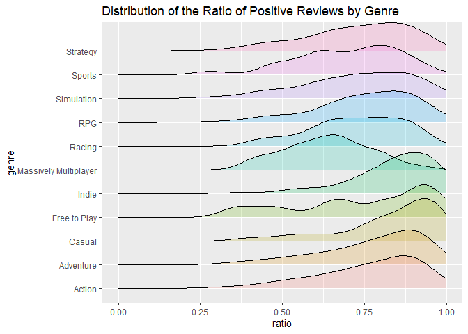
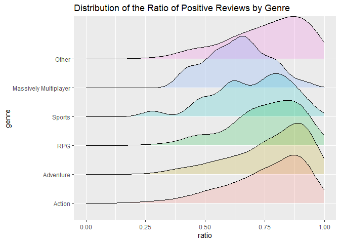

Mini Data-Analysis Deliverable 3
================

# Housekeeping Code

``` r
data <- readRDS(here::here('Milestone2','m2_end.RData')) # load cleaned data from milestone 2
library(datateachr) # <- might contain the data you picked!
library(tidyverse)
library(forcats)
library(lubridate)
library(tsibble)
```

# Two Research Questions

**1. What's the review difference between genres?**

The popular genres such as Action, Adventure, RPG, Massive Multipler. What's the difference between genres in terms of the average and total volume of reviews and average proportion of positive reviews of each genre.

**2. Use linear model with ratings as outcome variable **

# Exercise 1: Special Data Types (10)

### Plot from Previous Milestone

``` r
data %>%
  select(id, genre, ratio_of_postive_user_reviews) %>% 
  separate_rows(genre, sep= ",") %>% 
  filter(genre %in% c("Strategy","Sports","Simulation","RPG","Racing","Massively Multiplayer",
                      "Indie", "Free to Play","Casual","Adventure","Action")) %>% # filter out the non-popular genres. popularity based on prior knowledge. 
   ggplot(aes(x=ratio_of_postive_user_reviews, y= genre, fill = genre)) +
   ggridges::geom_density_ridges(alpha = .2) +
  xlab("ratio") + 
  ggtitle("Distribution of the Ratio of Positive Reviews by Genre") +
  xlim(0,1) +
  theme(legend.position = "none") 
```

    ## Picking joint bandwidth of 0.0504

    ## Warning: Removed 1628 rows containing non-finite values (stat_density_ridges).



### Choose Two Tasks

**Task Number**: 2 We will group some of the game genres together and label them as `other` since we suspect the player demographic in these genres is more casual compared to others. `Indie`,`Casual`,`Simulation`,`Strategy`, `Free to Play`, `Racing` are grouped as `Other`.

``` r
ex1 <- data %>%
  separate_rows(genre, sep= ",") %>% 
  filter(genre %in% c("Strategy","Sports","Simulation","RPG","Racing","Massively Multiplayer", "Indie", "Free to Play","Casual","Adventure","Action")) %>% 
  mutate(genre = as_factor(genre), genre =   fct_other(genre,drop=c("Indie","Casual","Simulation","Strategy", "Free to Play", "Racing")))

ex1 %>%
  select(id, genre, ratio_of_postive_user_reviews) %>% 
   ggplot(aes(x=ratio_of_postive_user_reviews, y= genre, fill = genre)) +
   ggridges::geom_density_ridges(alpha = .2) +
  xlab("ratio") + 
  ggtitle("Distribution of the Ratio of Positive Reviews by Genre") +
  xlim(0,1) +
  theme(legend.position = "none") 
```

    ## Picking joint bandwidth of 0.0447

    ## Warning: Removed 1628 rows containing non-finite values (stat_density_ridges).



**Task Number**: 3 We will extract the year of the game release date `release_date` and use it as one of the variable in the linear model to predict player sentiment, since we suspect that the games that are released later have better quality and players might rate them higher.

``` r
# make new column that extracts the year from release date
ex2 <- ex1 %>%
  filter(grepl(',', release_date))%>% # removes rows with inconsistent date format
  mutate(release_year = year(mdy(release_date)))
glimpse(ex2)
```

    ## Rows: 5,000
    ## Columns: 10
    ## $ id                            <dbl> 3, 3, 3, 14, 18, 21, 23, 24, 24, 30, 30,~
    ## $ name                          <chr> "BATTLETECH", "BATTLETECH", "BATTLETECH"~
    ## $ genre                         <fct> Action, Adventure, Other, Action, Action~
    ## $ publisher                     <chr> "Paradox Interactive,Paradox Interactive~
    ## $ original_price                <dbl> 39.99, 39.99, 39.99, 1.02, 59.99, 1.02, ~
    ## $ release_date                  <chr> "Apr 24, 2018", "Apr 24, 2018", "Apr 24,~
    ## $ ratio_of_postive_user_reviews <dbl> 0.71, 0.71, 0.71, 0.51, 0.77, 0.84, 0.70~
    ## $ number_of_total_reviews       <dbl> 7030, 7030, 7030, 1118, 1945, 4190, 487,~
    ## $ category                      <chr> "positive", "positive", "positive", "pos~
    ## $ release_year                  <dbl> 2018, 2018, 2018, 2017, 2019, 2010, 2019~

# Exercise 2: Modelling

## 2.0 (no points)

**Research Question**: Use linear regression with player sentiment as outcome and see if we can predict it based on the genre, original price, release year, and number of total reviews.

**Variable of interest**: `ratio_of_postive_user_reviews`

## 2.1 Fit a Model (5 points)

Clean the dataset and partition into training and testing set for the next question.

``` r
model_data <- ex2 %>% mutate(
  category = as.factor(category),
  genre = as.factor(genre),
  original_price = as.numeric(original_price),
  number_of_total_reviews = as.numeric(number_of_total_reviews),
  release_year = as.factor(release_year),
  ratio_of_postive_user_reviews = as.numeric(ratio_of_postive_user_reviews)
)

## 75% of the sample size
smp_size <- floor(0.75 * nrow(model_data))

## set the seed to make partition reproducible
set.seed(123)
train_ind <- sample(seq_len(nrow(model_data)), size = smp_size)

train <- model_data[train_ind, ]
test <- model_data[-train_ind, ]  
```

#### Store the model object as a variable, and print its output to screen.

``` r
lm <- lm(ratio_of_postive_user_reviews~ genre + original_price + number_of_total_reviews + release_year , data = train)

lm
```

    ## 
    ## Call:
    ## lm(formula = ratio_of_postive_user_reviews ~ genre + original_price + 
    ##     number_of_total_reviews + release_year, data = train)
    ## 
    ## Coefficients:
    ##                (Intercept)              genreAdventure  
    ##                  8.522e-01                   8.050e-03  
    ##                   genreRPG                 genreSports  
    ##                  1.393e-03                  -3.788e-02  
    ## genreMassively Multiplayer                  genreOther  
    ##                 -1.051e-01                   3.524e-03  
    ##             original_price     number_of_total_reviews  
    ##                 -2.517e-04                   2.133e-06  
    ##           release_year1989            release_year1990  
    ##                  4.984e-02                  -3.175e-02  
    ##           release_year1991            release_year1992  
    ##                 -8.738e-02                  -4.652e-05  
    ##           release_year1993            release_year1994  
    ##                  5.079e-02                  -6.017e-03  
    ##           release_year1995            release_year1996  
    ##                 -2.688e-01                   4.870e-02  
    ##           release_year1997            release_year1998  
    ##                  1.855e-02                   1.057e-02  
    ##           release_year1999            release_year2000  
    ##                 -6.951e-02                  -1.768e-02  
    ##           release_year2001            release_year2002  
    ##                 -5.180e-03                  -6.645e-02  
    ##           release_year2003            release_year2004  
    ##                 -7.695e-02                  -6.949e-02  
    ##           release_year2005            release_year2006  
    ##                 -6.162e-02                  -6.027e-02  
    ##           release_year2007            release_year2008  
    ##                 -6.975e-02                  -9.666e-02  
    ##           release_year2009            release_year2010  
    ##                 -9.481e-02                  -1.007e-01  
    ##           release_year2011            release_year2012  
    ##                 -9.106e-02                  -8.471e-02  
    ##           release_year2013            release_year2014  
    ##                 -9.630e-02                  -1.205e-01  
    ##           release_year2015            release_year2016  
    ##                 -1.121e-01                  -1.193e-01  
    ##           release_year2017            release_year2018  
    ##                 -9.405e-02                  -1.113e-01  
    ##           release_year2019  
    ##                 -1.080e-01

## 2.2 Extract Regression Coefficient and P-value (5 points)

Extract the regression coefficient and p-value of each term using the `broom`package.

``` r
broom::tidy(lm)
```

    ## # A tibble: 39 x 5
    ##    term                          estimate   std.error statistic       p.value
    ##    <chr>                            <dbl>       <dbl>     <dbl>         <dbl>
    ##  1 (Intercept)                 0.852      0.157           5.41  0.0000000679 
    ##  2 genreAdventure              0.00805    0.0103          0.782 0.435        
    ##  3 genreRPG                    0.00139    0.0114          0.122 0.903        
    ##  4 genreSports                -0.0379     0.0215         -1.76  0.0787       
    ##  5 genreMassively Multiplayer -0.105      0.0387         -2.72  0.00665      
    ##  6 genreOther                  0.00352    0.00776         0.454 0.650        
    ##  7 original_price             -0.000252   0.000123       -2.05  0.0400       
    ##  8 number_of_total_reviews     0.00000213 0.000000353     6.04  0.00000000173
    ##  9 release_year1989            0.0498     0.222           0.224 0.823        
    ## 10 release_year1990           -0.0317     0.172          -0.184 0.854        
    ## # ... with 29 more rows

# Exercise 3: Reading and writing data

Get set up for this exercise by making a folder called `output` in the top level of your project folder / repository. You'll be saving things there.

## 3.1 (5 points)

Take a summary table that you made from Milestone 2 (Exercise 1.2), and write it as a csv file in your `output` folder. Use the `here::here()` function.

-   **Robustness criteria**: You should be able to move your Mini Project repository / project folder to some other location on your computer, or move this very Rmd file to another location within your project repository / folder, and your code should still work.
-   **Reproducibility criteria**: You should be able to delete the csv file, and remake it simply by knitting this Rmd file.

``` r
# reference: https://stackoverflow.com/questions/4216753/check-existence-of-directory-and-create-if-doesnt-exist
if (!dir.exists(here::here("output"))){
  dir.create(here::here("output"))
}

sg_copy<- readRDS( here::here("Milestone1","m1_data.RData"))# read from milestone 2 data to recreate summary table

# create summary table below
genres_summary<- sg_copy %>%
  select(id, genre, ratio_of_postive_user_reviews, number_of_total_reviews) %>% 
  separate_rows(genre, sep= ",") %>% 
  filter(genre %in% c("Strategy","Sports","Simulation","RPG","Racing","Massively Multiplayer", "Indie", "Free to Play","Casual","Adventure","Action")) %>%
  group_by(genre) %>%
  summarise(number_of_titles = n_distinct(id),
            avg_ratio_of_postive_reviews = mean(ratio_of_postive_user_reviews, na.rm=T)
            ) %>%
    arrange(desc(number_of_titles))

# write csv, overwrite if already exists
write_csv(genres_summary,here::here("output","m3_3_1.csv") )
```

## 3.2 (5 points)

Write your model object from Exercise 2 to an R binary file (an RDS), and load it again. Be sure to save the binary file in your `output` folder. Use the functions `saveRDS()` and `readRDS()`.

-   The same robustness and reproducibility criteria as in 3.1 apply here.

``` r
saveRDS(lm,here::here("output",'m3_lm.rds'))

read_lm <- readRDS(here::here("output",'m3_lm.rds'))

read_lm
```

    ## 
    ## Call:
    ## lm(formula = ratio_of_postive_user_reviews ~ genre + original_price + 
    ##     number_of_total_reviews + release_year, data = train)
    ## 
    ## Coefficients:
    ##                (Intercept)              genreAdventure  
    ##                  8.522e-01                   8.050e-03  
    ##                   genreRPG                 genreSports  
    ##                  1.393e-03                  -3.788e-02  
    ## genreMassively Multiplayer                  genreOther  
    ##                 -1.051e-01                   3.524e-03  
    ##             original_price     number_of_total_reviews  
    ##                 -2.517e-04                   2.133e-06  
    ##           release_year1989            release_year1990  
    ##                  4.984e-02                  -3.175e-02  
    ##           release_year1991            release_year1992  
    ##                 -8.738e-02                  -4.652e-05  
    ##           release_year1993            release_year1994  
    ##                  5.079e-02                  -6.017e-03  
    ##           release_year1995            release_year1996  
    ##                 -2.688e-01                   4.870e-02  
    ##           release_year1997            release_year1998  
    ##                  1.855e-02                   1.057e-02  
    ##           release_year1999            release_year2000  
    ##                 -6.951e-02                  -1.768e-02  
    ##           release_year2001            release_year2002  
    ##                 -5.180e-03                  -6.645e-02  
    ##           release_year2003            release_year2004  
    ##                 -7.695e-02                  -6.949e-02  
    ##           release_year2005            release_year2006  
    ##                 -6.162e-02                  -6.027e-02  
    ##           release_year2007            release_year2008  
    ##                 -6.975e-02                  -9.666e-02  
    ##           release_year2009            release_year2010  
    ##                 -9.481e-02                  -1.007e-01  
    ##           release_year2011            release_year2012  
    ##                 -9.106e-02                  -8.471e-02  
    ##           release_year2013            release_year2014  
    ##                 -9.630e-02                  -1.205e-01  
    ##           release_year2015            release_year2016  
    ##                 -1.121e-01                  -1.193e-01  
    ##           release_year2017            release_year2018  
    ##                 -9.405e-02                  -1.113e-01  
    ##           release_year2019  
    ##                 -1.080e-01

# Tidy Repository

Now that this is your last milestone, your entire project repository should be organized. Here are the criteria we're looking for.

## Main README (3 points)

There should be a file named `README.md` at the top level of your repository. Its contents should automatically appear when you visit the repository on GitHub.

Minimum contents of the README file:

-   In a sentence or two, explains what this repository is, so that future-you or someone else stumbling on your repository can be oriented to the repository.
-   In a sentence or two (or more??), briefly explains how to engage with the repository. You can assume the person reading knows the material from STAT 545A. Basically, if a visitor to your repository wants to explore your project, what should they know?

Once you get in the habit of making README files, and seeing more README files in other projects, you'll wonder how you ever got by without them! They are tremendously helpful.

## File and Folder structure (3 points)

You should have at least four folders in the top level of your repository: one for each milestone, and one output folder. If there are any other folders, these are explained in the main README.

Each milestone document is contained in its respective folder, and nowhere else.

Every level-1 folder (that is, the ones stored in the top level, like "Milestone1" and "output") has a `README` file, explaining in a sentence or two what is in the folder, in plain language (it's enough to say something like "This folder contains the source for Milestone 1").
