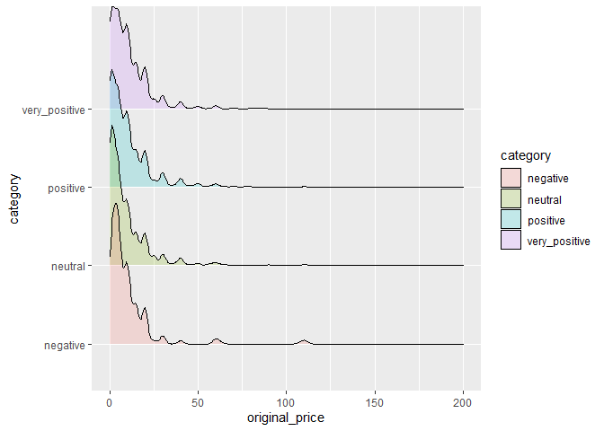

Mini Data Analysis Milestone 2
================

*To complete this milestone, you can either edit [this `.rmd` file](https://raw.githubusercontent.com/UBC-STAT/stat545.stat.ubc.ca/master/content/mini-project/mini-project-2.Rmd) directly. Fill in the sections that are commented out with `<!--- start your work here--->`. When you are done, make sure to knit to an `.md` file by changing the output in the YAML header to `github_document`, before submitting a tagged release on canvas.*

# Welcome back to your mini data analysis project!

This time, we will explore more in depth the concept of *tidy data*, and hopefully investigate further into your research questions that you defined in milestone 1.

**NOTE**: The main purpose of the mini data analysis is to integrate what you learn in class in an analysis. Although each milestone provides a framework for you to conduct your analysis, it's possible that you might find the instructions too rigid for your data set. If this is the case, you may deviate from the instructions -- just make sure you're demonstrating a wide range of tools and techniques taught in this class.

Begin by loading your data and the tidyverse package below:

``` r
sg_copy<-readRDS("m1_data.RData")
library(datateachr) # <- might contain the data you picked!
library(tidyverse)
library(ggrepel)
```

# Learning Objectives

By the end of this milestone, you should:

-   Become familiar with manipulating and summarizing your data in tibbles using `dplyr` and `tidyr`, with a research question in mind.
-   Understand what *tidy* data is, and how to create it. In milestone 3, we will explore when this might be useful.
-   Generate a reproducible and clear report using R Markdown.
-   Gain a greater understanding of how to use R to answer research questions about your data.

**Things to keep in mind**

-   Remember to document your code, be explicit about what you are doing, and write notes in this markdown document when you feel that context is required. Create your analysis as if someone else will be reading it! **There will be 2.5 points reserved for reproducibility, readability, and repo organization.**

-   Before working on each task, you should always keep in mind the specific **research question** that you're trying to answer.

# Task 1: Process and summarize your data (15 points)

From milestone 1, you should have an idea of the basic structure of your dataset (e.g. number of rows and columns, class types, etc.). Here, we will start investigating your data more in-depth using various data manipulation functions.

### 1.1 (2.5 points)

First, write out the 4 research questions you defined in milestone 1 were. This will guide your work through milestone 2:

<!-------------------------- Start your work below ---------------------------->
1.  Do some publishers get more positive reviews? Some studios recieve better public sentiment. My hypothesis is that the bigger publishers tend to get more mixed reviews (ratio of reviews that are positive lean towards 50%); on the other hand gamers are more forgiving towards smaller developers/publishers and hence will have more positive reviews.

2.  What's the difference between genres in terms of the average and total volume of reviews and average proportion of positive reviews of each genre. The popular genres such as Action, Adventure, RPG, Massive Multipler. What's the difference between genres in terms of the average and total volume of reviews and average proportion of positive reviews of each genre.

3.  Which publisher/developer produces the most games and receives the most positive reviews? We can see how much of the market a publisher takes up in the market and also gauge player sentiment towards a developer from these metrics.

4.  Use logistic regression with player sentiment as outcome variable and see if we can interpret the coefficients of the model. Interpreations of the coefficients can help us quantify how each factor contributes to player reviews.

<!----------------------------------------------------------------------------->
### 1.2 (10 points)

Now, for each of your four research questions, choose one task from options 1-4 (summarizing), and one other task from 4-8 (graphing). You should have 2 tasks done for each research question (8 total). Make sure it makes sense to do them! (e.g. don't use a numerical variables for a task that needs a categorical variable.). Comment on why each task helps (or doesn't!) answer the corresponding research question.

Ensure that the output of each operation is printed!

**Summarizing:**

1.  Compute the *range*, *mean*, and *two other summary statistics* of **one numerical variable** across the groups of **one categorical variable** from your data.
2.  Compute the number of observations for at least one of your categorical variables. Do not use the function `table()`!
3.  Create a categorical variable with 3 or more groups from an existing numerical variable. You can use this new variable in the other tasks! *An example: age in years into "child, teen, adult, senior".*
4.  Based on two categorical variables, calculate two summary statistics of your choosing.

**Graphing:**

1.  Create a graph out of summarized variables that has at least two geom layers.
2.  Create a graph of your choosing, make one of the axes logarithmic, and format the axes labels so that they are "pretty" or easier to read.
3.  Make a graph where it makes sense to customize the alpha transparency.
4.  Create 3 histograms out of summarized variables, with each histogram having different sized bins. Pick the "best" one and explain why it is the best.

Make sure it's clear what research question you are doing each operation for!

<!------------------------- Start your work below ----------------------------->
#### Research Question 1

Which publishers produces the most games and receives the most positive reviews?

``` r
# Tidy data: remove repetitive publishers names for each observation. Create a long table that if a game has multiple publishers, there will be multiple observations each having one unique publisher name for the same game. 
publishers <- sg_copy%>%
  select(id, publisher, ratio_of_postive_user_reviews,original_price) %>%
  group_by(id) %>%
  mutate(publisher = strsplit(as.character(publisher), ",")) %>% 
  unnest(publisher) %>% 
  drop_na() %>% # remove new observations with any NAs, could be caused by data tidying
  filter(!publisher %in% c(" Inc.", " LLC", " ltd.", " Ltd.", " LTD." )) %>%
  distinct() # return unique observations
```

##### Summarizing

Compute the range, mean, median, and standard deviation of ratio of positive user reviews, along with the number of games released on steam across the groups of publishers.

``` r
publisher_summary <- publishers %>% 
  group_by(publisher) %>%
  summarise(min = min(ratio_of_postive_user_reviews), # rating of the title with the least positive reviews received
            max = max(ratio_of_postive_user_reviews),
            mean = mean(ratio_of_postive_user_reviews),
            median = median(ratio_of_postive_user_reviews),
            sd = sd(ratio_of_postive_user_reviews), # spread
            games_on_steam = length(unique(id))) %>%
  arrange(desc( games_on_steam)) # order from the publisher that has the most games on Steam to least
```

##### Graphing

Create a graph out of summarized variables that has at least two geom layers. For visualization, the top 50 publishers with the most amount of games on Steam will be plotted here to gauge if there are any publishers that stand out in a positive way compared to others.

``` r
ggplot(publisher_summary[1:50,], aes(x= games_on_steam, y= mean, label = publisher)) +
  geom_point() +
  geom_smooth() +
  geom_label_repel(
    arrow = arrow(length = unit(0.03, "npc"), type = "closed", ends = "first"),
    force = 10) +
  ylim(0,1) + 
  xlab("Number of Games on Steam") + 
  ylab("Average Ratio of Positive Reviews")
```

    ## `geom_smooth()` using method = 'loess' and formula 'y ~ x'


Based on the scatterplot, we see that the top 10 publishers with the most amount of games on Steam seem to tend toward a mean of 75% positive reviews from their games, while a smaller publisher have a wider spread in terms of the average positive rates of games. Sekai Project and SCS Software are medium-to-large sized publishers and seem to have overall pretty positive reviews from most of their games.

#### Research Question 2

Do some publishers get more positive reviews? \#\#\#\#\# Summarizing Create a categorical variable with 3 or more groups from an existing numerical variable. For the games that each publisher owns, based on positive reviews, we will bucket them into a categorical variable with groups: - Negative (0,25%\] - Neutral (25%, 50%\] - Positive (50%,75%\] - Very\_Positive (75%,100\]

``` r
((publisher_categorical_review <- publishers %>% 
  mutate(category=cut(ratio_of_postive_user_reviews, breaks=c(0, 0.25, 0.5, 0.75, 1), labels=c("negative","neutral","positive","very_positive"))) %>%
  group_by(publisher, category) %>%
  summarise(n=n_distinct(id)) %>%
   filter(publisher %in% publisher_summary$publisher[1:20]) ## only look at the top 20 publishers on Steam
))
```

    ## `summarise()` has grouped output by 'publisher'. You can override using the `.groups` argument.

    ## # A tibble: 68 x 3
    ## # Groups:   publisher [20]
    ##    publisher        category          n
    ##    <chr>            <fct>         <int>
    ##  1 1C Entertainment neutral          10
    ##  2 1C Entertainment positive         40
    ##  3 1C Entertainment very_positive    35
    ##  4 2K               negative          1
    ##  5 2K               neutral          15
    ##  6 2K               positive         50
    ##  7 2K               very_positive    61
    ##  8 Activision       negative          1
    ##  9 Activision       neutral          13
    ## 10 Activision       positive         21
    ## # ... with 58 more rows

##### Graphing

Create a graph out of summarized variables that has at least two geom layers. Stacked Bar Chart

``` r
ggplot(publisher_categorical_review, 
       aes(fill=category,y=n ,x=publisher)) +
   geom_bar(position="fill", stat="identity")+
  coord_flip() +
  ylab("proportion of games")
```


#### Research Question 3

What's the difference between genres in terms of the average and total volume of reviews and average proportion of positive reviews of each genre.

##### Summarizing

Compute the number of observations within each genre. Based on prior knowledge, we choose the following 11 most popular genres and omit the other ones.

``` r
((genres_summary<- sg_copy %>%
  select(id, genre, ratio_of_postive_user_reviews, number_of_total_reviews) %>% 
  separate_rows(genre, sep= ",") %>% 
  filter(genre %in% c("Strategy","Sports","Simulation","RPG","Racing","Massively Multiplayer", "Indie", "Free to Play","Casual","Adventure","Action")) %>%
  group_by(genre) %>%
  summarise(number_of_titles = n_distinct(id),
            # total_reviews = sum(number_of_total_reviews, na.rm=T),
            # avg_reviews_per_title = mean(number_of_total_reviews, na.rm=T),
            avg_ratio_of_postive_reviews = mean(ratio_of_postive_user_reviews, na.rm=T)
            ) %>%
    arrange(desc(number_of_titles))
))
```

    ## # A tibble: 11 x 3
    ##    genre                 number_of_titles avg_ratio_of_postive_reviews
    ##    <chr>                            <int>                        <dbl>
    ##  1 Indie                            22868                        0.757
    ##  2 Action                           15265                        0.743
    ##  3 Casual                           12010                        0.749
    ##  4 Adventure                        11871                        0.748
    ##  5 Simulation                        8711                        0.706
    ##  6 Strategy                          7975                        0.720
    ##  7 RPG                               6962                        0.746
    ##  8 Free to Play                      2620                        0.715
    ##  9 Sports                            1725                        0.718
    ## 10 Racing                            1384                        0.714
    ## 11 Massively Multiplayer             1277                        0.645

##### Graphing

Create a graph out of the summarized variable- number of observation by genre, that has at least two geom layers.

``` r
ggplot(genres_summary, aes(number_of_titles, avg_ratio_of_postive_reviews, label= genre))+
  geom_point() +
  geom_label_repel(
    arrow = arrow(length = unit(0.02, "npc"), type = "closed", ends = "first"),
    force = 2,
    size = 2) +
  ylab("Averge Ratio of Positive Reviews") +
  xlab("Number of Games in Genre") +
  ylim(0,1)
```


#### Research Question 4:

Use logistic regression with player sentiment as outcome variable and see if we can interpret the coefficients of the model.

We continue to try and find if there are other variables in the dataset that contribute to players' sentiment towards a game. We now use the categorized game review that we obtained in Reseach Question \#2. We want to see if there are any correlation between player sentiment and the original pricing of the game. \#\#\#\#\# Summary: Compute the *range*, *mean*, and *two other summary statistics* of original price across the groups of player review defined in Research Question 2.

``` r
publishers <- publishers %>% 
  mutate(category=cut(ratio_of_postive_user_reviews, breaks=c(0, 0.25, 0.5, 0.75, 1), labels=c("negative","neutral","positive","very_positive"))) %>%
  group_by(category) %>% 
  filter(id != 18640, !is.na(category))  # this original price is 650560 which is not very likely
  
  
publishers %>%  
summarise(min= min(original_price),
            max= max(original_price),
            IQR= IQR(original_price),
            mean = mean(original_price),
            median = median(original_price),
            sd = sd(original_price),
            n=n_distinct(id))
```

    ## # A tibble: 4 x 8
    ##   category        min   max   IQR  mean median    sd     n
    ##   <fct>         <dbl> <dbl> <dbl> <dbl>  <dbl> <dbl> <int>
    ## 1 negative          0  111.     7  9.68   4.99  13.3   272
    ## 2 neutral           0  625.    11 14.8    4.99  50.3  1645
    ## 3 positive          0  625.    13 17.3    6.99  50.1  5216
    ## 4 very_positive     0  625.    12 15.2    7.99  43.3  9165

##### Graphing

Make a graph where it makes sense to customize the alpha transparency.

``` r
ggplot(publishers, aes(x=original_price, y= category, fill = category)) +
   ggridges::geom_density_ridges(alpha = .2) 
```

    ## Picking joint bandwidth of 1.5


``` r
ggplot(publishers, aes(x=original_price, y= category, fill = category)) +
   ggridges::geom_density_ridges(alpha = .2) + xlim(0,200)
```

    ## Picking joint bandwidth of 1.5

    ## Warning: Removed 200 rows containing non-finite values (stat_density_ridges).



``` r
ggplot(publishers, aes(x=original_price, y= category, fill = category)) +
   ggridges::geom_density_ridges(alpha = .2) + xlim(0,50)
```

    ## Picking joint bandwidth of 1.43

    ## Warning: Removed 610 rows containing non-finite values (stat_density_ridges).


### 1.3 (2.5 points)

Based on the operations that you've completed, how much closer are you to answering your research questions? Think about what aspects of your research questions remain unclear. Can your research questions be refined, now that you've investigated your data a bit more? Which research questions are yielding interesting results?

<!------------------------- Write your answer here ---------------------------->
<!----------------------------------------------------------------------------->
# Task 2: Tidy your data (12.5 points)

In this task, we will do several exercises to reshape our data. The goal here is to understand how to do this reshaping with the `tidyr` package.

A reminder of the definition of *tidy* data:

-   Each row is an **observation**
-   Each column is a **variable**
-   Each cell is a **value**

*Tidy'ing* data is sometimes necessary because it can simplify computation. Other times it can be nice to organize data so that it can be easier to understand when read manually.

### 2.1 (2.5 points)

Based on the definition above, can you identify if your data is tidy or untidy? Go through all your columns, or if you have &gt;8 variables, just pick 8, and explain whether the data is untidy or tidy.

<!--------------------------- Start your work below --------------------------->
<!----------------------------------------------------------------------------->
### 2.2 (5 points)

Now, if your data is tidy, untidy it! Then, tidy it back to it's original state.

If your data is untidy, then tidy it! Then, untidy it back to it's original state.

Be sure to explain your reasoning for this task. Show us the "before" and "after".

<!--------------------------- Start your work below --------------------------->
<!----------------------------------------------------------------------------->
### 2.3 (5 points)

Now, you should be more familiar with your data, and also have made progress in answering your research questions. Based on your interest, and your analyses, pick 2 of the 4 research questions to continue your analysis in milestone 3, and explain your decision.

Try to choose a version of your data that you think will be appropriate to answer these 2 questions in milestone 3. Use between 4 and 8 functions that we've covered so far (i.e. by filtering, cleaning, tidy'ing, dropping irrelvant columns, etc.).

<!--------------------------- Start your work below --------------------------->
<!----------------------------------------------------------------------------->
*When you are done, knit an `md` file. This is what we will mark! Make sure to open it and check that everything has knitted correctly before submitting your tagged release.*

### Attribution

Thanks to Victor Yuan for mostly putting this together.
